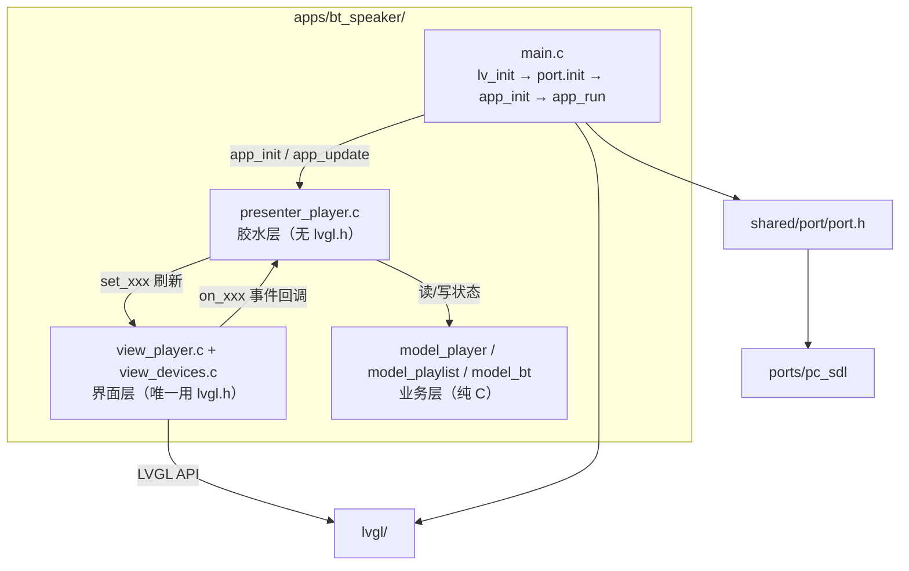
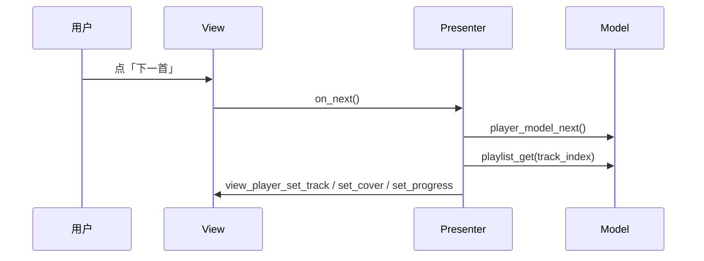
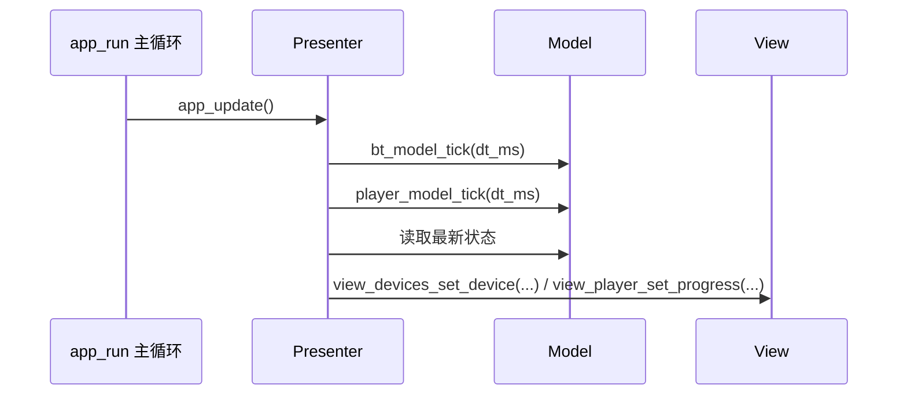
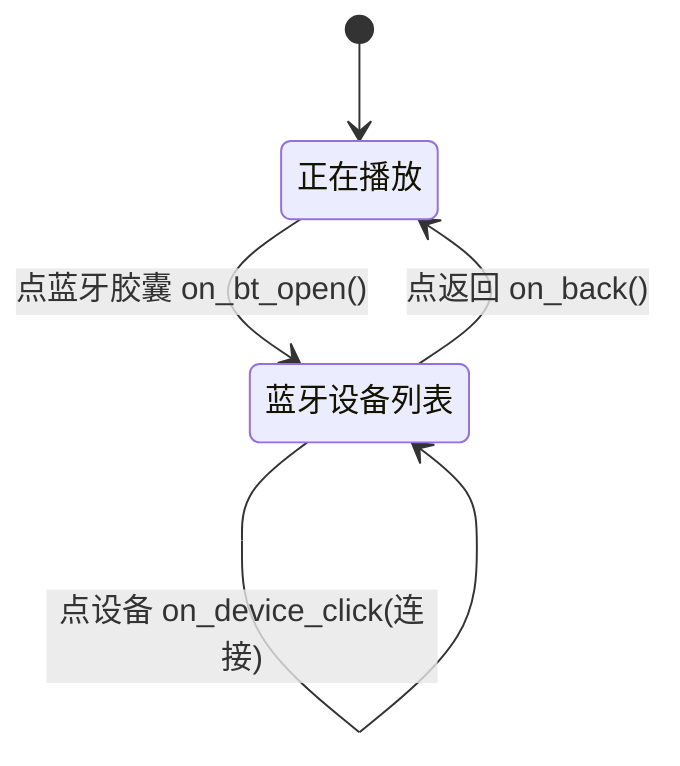
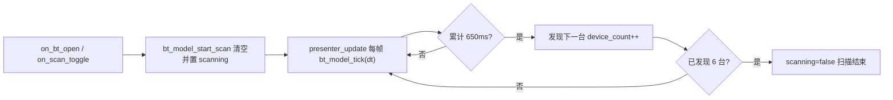

# bt_speaker 应用

竖屏 **480×640** 蓝牙音箱 UI：一个「正在播放」屏 + 一个「蓝牙设备列表」屏，深色主题。
是仓库里**最完整的四层解耦示例**（3 个 model + 2 个 view + 1 个 presenter + 双屏导航）。

状态：PC 模拟（SDL2）已验证。

## 快速开始

```powershell
# Windows（MSYS2 UCRT64）
.\build.ps1 -App bt_speaker -Run
```

```bash
# Linux / macOS
cmake -B build -DAPP=bt_speaker -DPORT=pc_sdl
cmake --build build -j
./bin/bt_speaker
```

## 界面概览

两屏，深色主题（背景 `#101418`、卡片 `#1C2128`、高亮 `#4FC3F7`）：

**屏 1 · 正在播放**（默认屏，见 `../../docs/bt_speaker_preview.png`）

- 顶部状态栏：蓝牙胶囊（可点击，进入设备列表）、时钟、电量
- 专辑封面 340×340（来自 LVGL demo 内置封面）
- 歌名 / 歌手
- 进度条（可拖动跳转）+ 已播/总时长
- 控制键：上一首 / 播放暂停（高亮圆钮）/ 下一首
- 音量滑块

**屏 2 · 蓝牙设备列表**（点状态栏蓝牙胶囊进入，见 `../../docs/bt_speaker_devices.png`）

- 头部：返回按钮 + 标题 `Bluetooth Devices`
- 扫描状态文字 + 刷新按钮
- 最多 6 行设备卡片：名称 / MAC 地址 / 右侧状态（`Connected` / `Paired` / `→`）

## 总体架构



## 目录结构与代码架构

```
apps/bt_speaker/
├── CMakeLists.txt
├── lv_conf.h                          # LV_DEMO_MUSIC_LARGE=1、montserrat 字体、demos 开启
└── src/
    ├── main.c                         # app_init → presenter_player_init；app_update → presenter_player_update
    ├── model/
    │   ├── model_player.c/h           # 播放状态：播放/曲目/进度/音量/蓝牙/电量
    │   ├── model_playlist.c/h         # 曲目表（3 首占位数据）
    │   └── model_bt.c/h               # 蓝牙设备：扫描/发现/连接（6 台占位设备）
    ├── presenter/
    │   └── presenter_player.c/h       # 组装 model 与 view、双屏导航、周期刷新
    └── ui/
        ├── view_player.c/h            # 「正在播放」屏
        └── view_devices.c/h           # 「蓝牙设备列表」屏
```

| 文件 | 职责 |
|------|------|
| `src/main.c` | 极薄骨架；`app_update()` 把周期任务交给 presenter |
| `src/ui/view_player.c` | 画播放屏 + 状态栏；按钮/滑块触发回调 |
| `src/ui/view_devices.c` | 画设备列表屏；返回/扫描/点设备触发回调 |
| `src/presenter/presenter_player.c` | 持有 `player_model_t` + `bt_model_t` 实例，翻译回调、刷新、切屏 |
| `src/model/model_player.c` | 播放状态机（切歌循环、到尾自动下一首） |
| `src/model/model_playlist.c` | 只读曲目数据源 |
| `src/model/model_bt.c` | 蓝牙扫描状态机（每 650ms「发现」一台） |

## 分层与代码原理

铁律不变：**Model 与 Presenter 禁止 `#include "lvgl.h"`**，只有 `src/ui/` 直接碰 LVGL。

| 层 | 目录 | 允许 | 禁止 |
|----|------|------|------|
| View | `src/ui/` | 画控件、触发回调 | 写业务规则、直接改 model |
| Presenter | `src/presenter/` | 翻译 UI 事件 ↔ Model、决定切屏 | 持有布局细节 |
| Model | `src/model/` | 纯 C 业务（播放/扫描状态机） | `#include "lvgl.h"` |

几个关键设计点：

1. **View 只回调，Presenter 决定一切**：`view_player`/`view_devices` 对外暴露的是一组事件结构体
   （`on_play_pause`、`on_back`、`on_device_click`…），Presenter 实现这些回调；View 不读 model。
2. **Presenter 持有 model 实例**：`static player_model_t s_model; static bt_model_t s_bt;`
   是唯一「同时知道 Model 和 View」的地方。
3. **切屏也走 Presenter**：View 暴露 `view_player_show()` / `view_devices_show()`（内部 `lv_scr_load`），
   由 Presenter 的回调决定何时切换，View 层不持有另一屏的引用。
4. **程序化刷新抑制回环**：`view_player.c` 用 `s_refreshing` 标志，`set_progress`/`set_volume` 里程序设
   slider 时不触发 `on_seek`/`on_volume_changed`，避免「刷新 → 回调 → 又刷新」死循环。

验收：`grep -R "lvgl.h" apps/bt_speaker/src/model apps/bt_speaker/src/presenter` 结果应为空。

## 核心数据流

### 用户事件流（点击 / 拖动）



### 周期刷新流（播放进度 + 蓝牙扫描）



> Presenter 里对进度做了**节流**：只在「秒」变化时刷进度显示，避免每帧刷 UI；
> 对扫描结果做了**增量推送**：只把新发现的设备推给 View。

## 业务流程（双屏导航 + 扫描）

### 双屏导航状态机



### 扫描发现流程



原理：`model_bt.c` 里 `REVEAL_INTERVAL_MS = 650`，`bt_model_tick` 每累计 650ms 把预置设备表
`devices[next_reveal]` 填进来并 `device_count++`，Presenter 检测到 `count` 变化就调
`view_devices_set_device()` 把新设备推到界面，营造「逐步发现」的效果。

## 接口契约

### View 事件（Presenter 实现这些回调）

`view_player_events_t`（`src/ui/view_player.h`）：

| 回调 | 触发 |
|------|------|
| `on_play_pause()` | 播放/暂停按钮 |
| `on_prev()` / `on_next()` | 上一首 / 下一首 |
| `on_volume_changed(vol)` | 音量滑块 |
| `on_bt_open()` | 状态栏蓝牙胶囊 |
| `on_seek(ms)` | 进度条拖动 |

`view_devices_events_t`（`src/ui/view_devices.h`）：

| 回调 | 触发 |
|------|------|
| `on_back()` | 返回按钮 |
| `on_scan_toggle()` | 扫描按钮 |
| `on_device_click(index)` | 点某一行设备 |

### Model 函数（Presenter 调用）

`model_player.h`：`player_model_init / toggle_play / next / prev / set_volume / toggle_bt / seek / tick`
+ 只读 `is_playing / get_track_index / get_elapsed_ms / get_volume / is_bt_connected / get_battery`。

`model_playlist.h`：`playlist_count()`、`playlist_get(index)`（返回 `track_t{title, artist, duration_ms, cover}`，共 3 首）。

`model_bt.h`：`bt_model_init / start_scan / stop_scan / connect / disconnect / tick`
+ 只读 `get_count / get / is_scanning / get_connected / is_any_connected`。

### Presenter 接口（main.c 调用）

```c
void presenter_player_init(void);   /* 组装两屏 + 双 model，默认进播放屏 */
void presenter_player_update(void); /* 每轮主循环由 app_update() 调用 */
```

## 扩展指南

### 加第三个屏（如「设置」）

1. 新建 `src/ui/view_settings.{c,h}`：仿 `view_devices.h` 定义 `view_settings_events_t` + `init/show/set_*`；
   内部用 `lv_obj_create(NULL)` 建独立屏幕、`lv_scr_load` 切换。
2. 在 `presenter_player.c` 加 `on_settings_open()` / `on_settings_back()` 回调，实现 `view_settings_show()` 切换。
3. 在「正在播放」屏加一个入口按钮（在 `view_player.h` 的 events 里加 `on_settings_open`）。
4. `CMakeLists.txt` 里 `lvgl_add_app(bt_speaker ...)` 补上 `src/ui/view_settings.c`。

### 加一个业务模块（如「歌单收藏」）

1. 新建 `src/model/model_favorites.{c,h}`（纯 C，禁 lvgl.h）。
2. Presenter 加 `static favorites_model_t s_fav;` 并在 `presenter_player_init` 里 `favorites_model_init`。
3. 需要 UI 时再对应加 view + 回调，按上面「加屏」步骤接起来。

## 约定与注意事项

- **UI 字符串用英文**（内置蒙诺字体无 CJK 字形，中文会显示为方框）。
- 封面来自 LVGL demo 内置符号 `img_lv_demo_music_cover_1/2/3`，需 `lv_conf.h` 开启
  `LV_DEMO_MUSIC_LARGE 1` 才是 428×428 大图；`view_player.c` 用 `LV_IMAGE_ALIGN_CONTAIN_DOWNSCALE` 缩放为 340。
- `view_player_init` 必须先于 `view_devices_init` 调用（深色主题在 `view_player_init` 里统一初始化）。
- 应用只依赖 `shared/port/port.h`，对平台零感知；接真实蓝牙栈时把 `model_bt.c` 换成 `service` 层调用即可。
- 提交纪律：改动单独提交，写明 `apps/bt_speaker`；不提交 `build/`、`bin/`。
