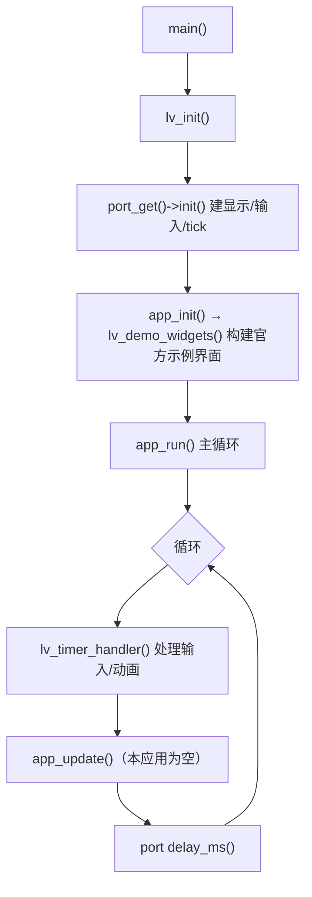

# demo_widgets 应用

LVGL 官方控件示例的薄封装，用于**验证环境与脚手架是否正常**（显示器、输入、字体、demos 编译）。
它**不是分层示例**——不分 View/Presenter/Model。

状态：PC 模拟（SDL2）已验证。

## 快速开始

```powershell
# Windows（MSYS2 UCRT64）
.\build.ps1 -App demo_widgets -Run
```

```bash
# Linux / macOS
cmake -B build -DAPP=demo_widgets -DPORT=pc_sdl
cmake --build build -j
./bin/demo_widgets
```

## 它是干嘛的

跑起来会看到 LVGL 官方控件大杂烩（按钮、滑块、图表、日历、键盘等），用来确认：

1. SDL2 显示/输入驱动正常；
2. `lvgl/` 库与 demos 正确编译链接；
3. 字体、主题等基础能力可用。

## 代码结构

整个应用只有一个源文件：

```
apps/demo_widgets/
├── CMakeLists.txt      # lvgl_add_app(demo_widgets src/main.c)
├── lv_conf.h           # 启用了 LV_USE_DEMO_WIDGETS
└── src/main.c          # 只调 lv_demo_widgets()
```



## 与分层应用的关系

| 应用 | 定位 |
|------|------|
| `demo_widgets` | 官方示例，验证环境，**无分层** |
| `hello_world` | 最小四层模板（新建应用请复制它） |
| `bt_speaker` | 真实业务示例（多屏 + 多 model 分层） |

想学「View / Presenter / Model 解耦」的写法，看 `hello_world/README.md` 与 `bt_speaker/README.md`；
控件本身的用法看 [LVGL 官方文档](https://docs.lvgl.io/) 与 `lvgl/examples/`。

## 约定与注意事项

- 本应用直接调用 `lv_demo_widgets()`，属于「验证型」而非「业务型」应用。
- `lv_conf.h` 里 `LV_USE_DEMO_WIDGETS` 必须为 1 才能编译。
- 其它约定见根 `README.md` 与 `docs/`。
