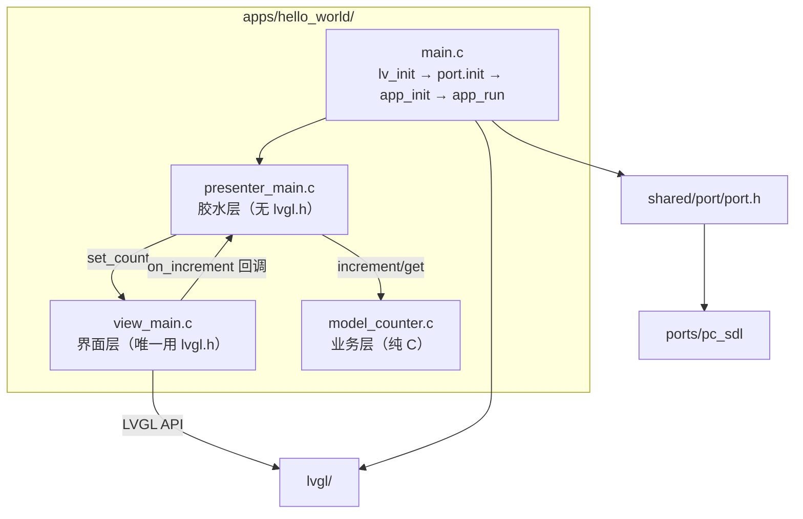
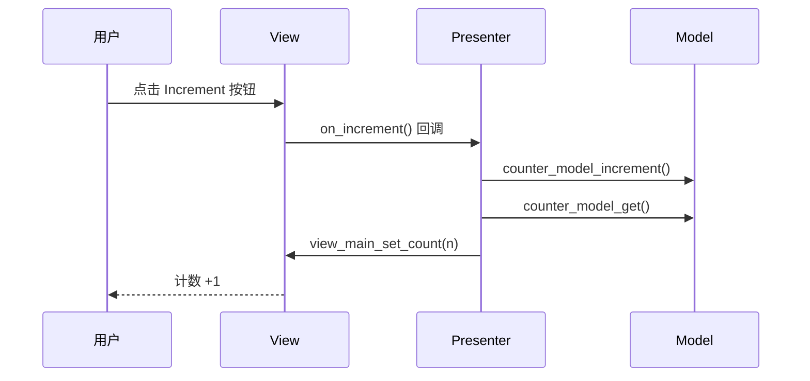
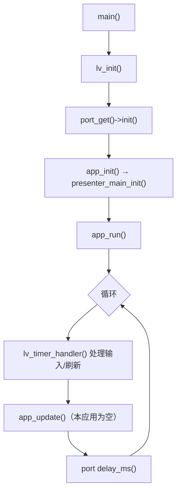
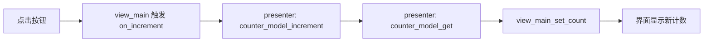

# hello_world 应用

最小四层结构模板（View / Presenter / Model），用于演示「一次点击在代码里怎么流转」。
**新建应用请复制本目录**，再按需扩展。

状态：PC 模拟（SDL2）已验证。

## 快速开始

```powershell
# Windows（MSYS2 UCRT64）
.\build.ps1 -App hello_world -Run
```

```bash
# Linux / macOS
cmake -B build -DAPP=hello_world -DPORT=pc_sdl
cmake --build build -j
./bin/hello_world
```

## 界面概览

一个 480×640 竖屏界面，只有三个控件：

- 顶部标题 `Hello LVGL!`
- 中间计数 `Count: 0`
- 底部按钮 `Increment`，每点一次计数 +1

## 总体架构



## 目录结构与代码架构

```
apps/hello_world/
├── CMakeLists.txt               # lvgl_add_app() 列出本应用源文件
├── lv_conf.h                    # 应用专属 LVGL 配置
└── src/
    ├── main.c                   # 入口：实现 app_init()
    ├── model/
    │   ├── model_counter.h      # 计数器模型接口
    │   └── model_counter.c      # 计数器实现（纯 C）
    ├── presenter/
    │   ├── presenter_main.h     # 组装接口
    │   └── presenter_main.c     # 把 Model 与 View 接起来
    └── ui/
        ├── view_main.h          # 界面对外接口 + 回调类型
        └── view_main.c          # 画界面 + 触发回调
```

| 文件 | 职责 |
|------|------|
| `src/main.c` | 全应用共用的极薄骨架，只调 `presenter_main_init()` |
| `src/ui/view_main.c` | 创建标题/计数/按钮，点击时触发 `on_increment` 回调 |
| `src/presenter/presenter_main.c` | 持有 model 实例，把回调翻译成「改 model + 刷 view」 |
| `src/model/model_counter.c` | 一个计数器，`increment` / `get`，无任何 UI 概念 |

## 分层与代码原理

铁律：**业务层禁止 `#include "lvgl.h"`**，这样业务逻辑可跨 LVGL 版本、甚至脱离 LVGL 单独单元测试。

| 层 | 目录 | 允许 | 禁止 |
|----|------|------|------|
| View | `src/ui/` | 操作 LVGL 控件、回调 Presenter | 写业务规则 |
| Presenter | `src/presenter/` | 翻译 UI 事件 ↔ Model | 持有布局细节 |
| Model | `src/model/` | 纯 C 业务、可单测 | `#include "lvgl.h"` |

依赖方向单向：`main → Presenter → {Model, View}`，`View → Presenter`（只通过回调，不反向依赖）。
验收：`grep -R "lvgl.h" apps/hello_world/src/model apps/hello_world/src/presenter` 结果应为空。

## 核心数据流

本应用**纯事件驱动**，没有 `app_update()`，因此只有「用户事件流」一条主线：



主循环生命周期（无周期业务，`app_update` 未实现，走弱符号默认空实现）：



## 业务流程（计数器自增）



## 接口契约

### View 层（`src/ui/view_main.h`）

```c
typedef void (*view_main_increment_cb_t)(void);

void view_main_init(view_main_increment_cb_t on_increment);
void view_main_set_count(uint32_t count);
```

| 函数 | 说明 |
|------|------|
| `view_main_init(on_increment)` | 建界面，注册「加一」回调 |
| `view_main_set_count(count)` | 更新计数显示 |

### Model 层（`src/model/model_counter.h`）

```c
typedef struct { uint32_t count; } counter_model_t;

void     counter_model_init(counter_model_t * m);
void     counter_model_increment(counter_model_t * m);
uint32_t counter_model_get(const counter_model_t * m);
```

### Presenter 层（`src/presenter/presenter_main.h`）

```c
void presenter_main_init(void);
```

## 扩展指南（以「加一个减一按钮」为例）

1. **Model**：在 `model_counter.h/c` 加 `void counter_model_decrement(counter_model_t * m);`
2. **View**：在 `view_main.h` 加回调类型 `view_main_decrement_cb_t`；`view_main_init` 增加第二个回调参数；`view_main.c` 里新建按钮并 `lv_obj_add_event_cb(..., LV_EVENT_CLICKED, ...)` 触发它。
3. **Presenter**：加 `static void on_decrement_clicked(void)`，内部调 `counter_model_decrement` + `view_main_set_count`；在 `presenter_main_init` 里把新回调传给 `view_main_init`。
4. **构建**：`.\build.ps1 -App hello_world -Run`。

## 约定与注意事项

- 界面字符串用英文（内置蒙诺字体无 CJK 字形，中文会显示为方框）。
- 本应用只依赖 `shared/port/port.h` 的 `init/tick_ms/delay_ms`，对平台零感知。
- `lv_conf.h` 是应用专属的，可按需裁剪特性（关 demos、调内存池）。
- 提交纪律：改动单独提交，写明 `apps/hello_world`；不提交 `build/`、`bin/`。
