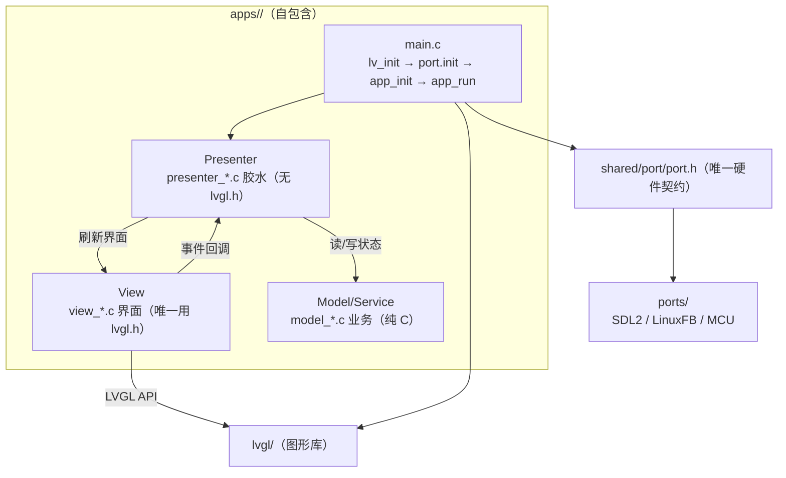
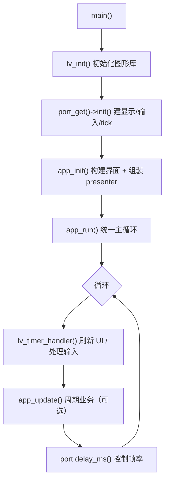
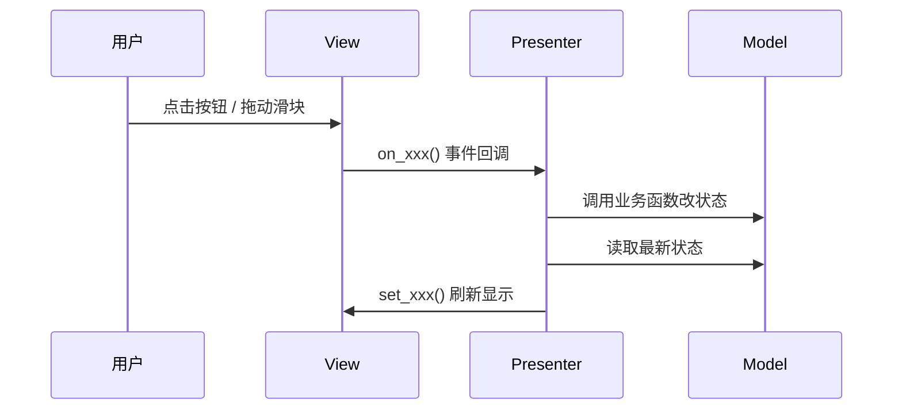
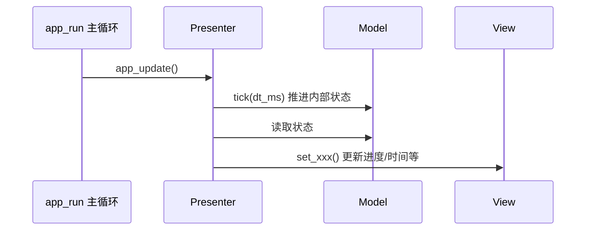

# 06 · 应用文档规范

每个 `apps/<APP>/` 应用都必须配一份 `README.md`，让新手不看代码也能快速上手：
这个应用是干什么的、怎么跑起来、代码分几层、一次点击在代码里怎么流转、想加功能该改哪里。

本文档是**统一模板**：新建应用时直接按下面的章节复制改写，保持全仓库一致。

## 放哪里 / 什么时候写

- 位置：`apps/<APP>/README.md`（GitHub 会自动在目录首页渲染）。
- 时机：应用首次可运行时写，与代码**同一次提交**，避免文档落后于代码。
- 语言：文档用中文；**界面里显示的字符串用英文**（内置蒙诺字体没有 CJK 字形，中文会显示为方框）。

## 固定章节模板

按顺序写，章节名保持一致：

| # | 章节 | 内容 |
|---|------|------|
| 1 | `# <APP> 应用` | 一句话定位 + 状态（PC 模拟 / 已上板） |
| 2 | `## 快速开始` | PC 一键命令 + Linux CMake 命令 |
| 3 | `## 界面概览` | 截图 + 关键控件布局说明 |
| 4 | `## 总体架构` | Mermaid `flowchart`（图 D1） |
| 5 | `## 目录结构与代码架构` | 文件树 + 每个文件职责表 |
| 6 | `## 分层与代码原理` | 铁律表 + 依赖方向 + 为什么这样分 |
| 7 | `## 核心数据流` | Mermaid `sequenceDiagram`（图 D3 / D4） |
| 8 | `## 业务流程` | Mermaid `stateDiagram` 或 `flowchart`（图 D5，app 专属） |
| 9 | `## 接口契约` | view 事件回调表 / model 函数表 / presenter 接口表 |
| 10 | `## 扩展指南` | 分步：加 model → 加 presenter 回调 → 加 view → 改 CMakeLists |
| 11 | `## 约定与注意事项` | CJK 用英文、`lv_conf.h` 应用专属、只依赖 `port.h`、提交纪律 |

## Mermaid 图骨架（四张通用图）

Mermaid 一律用标准 ` ```mermaid ` 围栏，GitHub / 主流预览器原生渲染（VSCode 需装 `bierner.markdown-mermaid` 插件）。

### 图 D1 · 总体架构（flowchart，每个应用必画）

把应用的 `main.c / Presenter / View / Model` 与 `port / lvgl` 的关系画出来：



> 说明：数据/调用永远单向 —— `View 回调 → Presenter → Model`，`Model 改完 → Presenter 读回 → View 刷新`。
> Presenter 与 Model **不 include `lvgl.h`**，只有 View 直接碰 LVGL。

### 图 D2 · 生命周期 / 主循环（flowchart，每个应用必画）



### 图 D3 · 用户事件流（sequenceDiagram，有交互的应用必画）



### 图 D4 · 周期刷新流（sequenceDiagram，实现了 `app_update()` 的应用才画）



> 没有周期任务的简单应用（如 `hello_world` 纯事件驱动）可省略 D4，在文档里说明原因即可。

### 图 D5 · 业务流程（app 专属）

按应用的实际功能选一种：
- 有明确**状态切换**（如多屏导航）用 `stateDiagram-v2`；
- 有**多步操作**（如「点击 → 自增 → 刷新」）用 `flowchart`。

## 按复杂度裁剪（不搞一刀切）

| 档位 | 适用 | 要求 |
|------|------|------|
| 精简 | `demo_widgets`（官方示例薄封装、无分层） | 简介/运行/它是干嘛的/代码结构/指向官方文档，**不硬套三层图** |
| 基准 | `hello_world`（最小四层模板） | 完整 11 章，D1/D2/D3/D5 四张图，D4 省略并说明 |
| 完整 | `bt_speaker`（多屏 + 多 model 的真实业务） | 完整 11 章 + D1~D5 五张图 + 完整接口契约表 |

## 写作纪律

1. **函数名 / 事件名 / 文件路径必须与源码逐字一致**（写文档时逐个文件核对）。
2. 代码块里的接口签名照抄 `.h` 文件，不要凭记忆改写。
3. 不重复 LVGL 官方控件 API 用法（有上游文档），不重复环境搭建（见 `docs/`）。
4. 文档与代码同 commit；改代码改了接口时，同步改对应 app 的 README。
